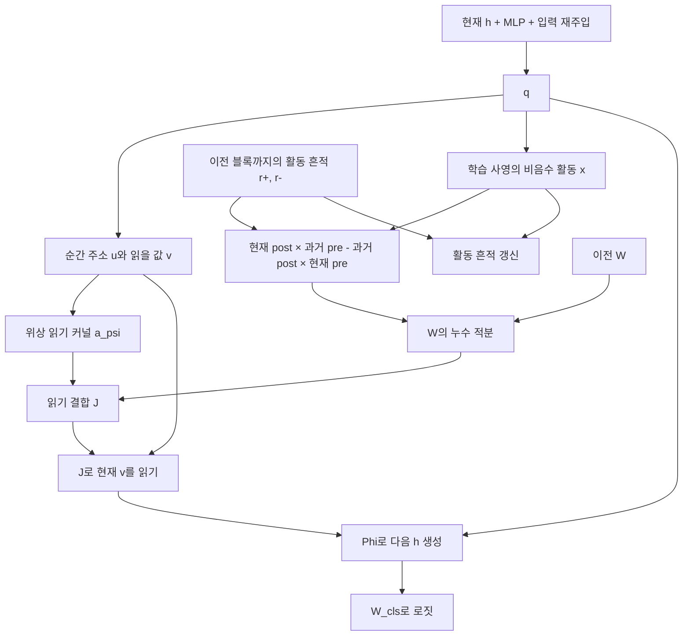

# v1.2 초안: 실제 활동 이력과 부호가 정해진 시간차 쓰기

2026-09-26. **설계·참조 구현·수식 검산 완료. 스도쿠 학습과 성능 검증 전.**

이번 안은 발화 선후 규칙을 구조로 보장한다. 학습은 어떤 내부 활동을 비교할지,
얼마나 오래 기억할지, 강화와 약화의 상대 크기, 읽기 기여도를 결정한다.
선후 규칙이 학습에서 자발적으로 생겼다고 주장하는 모델은 아니다.

현재 v1.1 연구 결과는 [보고서](phase_timing_research_v11.md)에 있다.
이 설계에서는 순간 주소를 시간주파수로 간주하는 대신, 쓰기의 시간창을 먼저 정의한다.
그 창의 정확한 푸리에 표현도 도출한다. 같은 연산을 작은 실수 흔적 상태로 구현하므로
별도의 복소 주파수 뱅크나 자유로운 β가 필요하지 않다.

## 1. 한 블록의 구조



기본 크기: hidden 832, 8헤드, 순간 복소 주소 52성분/헤드,
시간 활동 C=16성분/헤드, 시간척도 M=4개/분기.
블록 순서는 v1.1의 pre 순서를 사용한다. 이번 변경 대상은 쓰기 경로다.

## 2. 활동: 모델에서 실제로 흔적에 입력되는 신호

\[
q_i(k)=h_i(k)+MLP(h_i(k))+\sqrt d\,E_i,
\]
\[
y_{i,h,c}(k)=(U_h q_i(k))_c,\qquad
x_{i,h,c}(k)=\frac{y_{i,h,c}(k)^2}{1+\sum_b y_{i,h,b}(k)^2}.
\]

U는 학습하는 별도 사영이다. x는 소급해서 붙인 이름이 아니라 코드가 실제로
흔적 상태에 주입하는 활동이다. 각 성분은 비음수이고 합은 1 미만이다.
제곱은 기존 MLP와 같은 곱셈 기반 비선형 연산이며 발화 임계값은 추가하지 않는다.

x의 각 성분은 학습된 특징의 활동 세기다. 특정 숫자, 정답 확정, 논리적 모순을
직접 의미하도록 지정하지 않았다. 그 의미와 과제 유용성은 학습 후 따로 분석한다.
이진 스파이크가 아닌 연속 활동형 쓰기이며, 고립된 펄스에 대한 부호 규칙도 만족한다.
제곱 사영은 y의 부호를 구별하지 않는다는 표현 제약이 있다.

## 3. 두 종류의 과거 흔적

각 셀·헤드·활동 채널에 강화용과 약화용 흔적을 둔다.

\[
r^{\pm}_{i,m,c}(k)
=\rho^{\pm}_{m}r^{\pm}_{i,m,c}(k-1)
 +(1-\rho^{\pm}_{m})x_{i,c}(k),
\qquad \rho_m^{\pm}=e^{-1/\tau_m^{\pm}}.
\]

헤드 인덱스는 이후 생략한다. τ의 초기값은 양쪽 모두 2·8·32·128블록,
학습 범위는 1~256블록이다. 흔적 초기값은 0이다.
따라서 **쓰기 직전에 읽는** 흔적은 정확히

\[
r^{\pm}_{i,m,c}(k-1)
=\sum_{d\ge1}(1-\rho_m^{\pm})(\rho_m^{\pm})^{d-1}x_{i,c}(k-d).
\]

현재 x는 G 계산을 끝낸 뒤 이력에 추가한다. 주소처럼 단위 노름으로 다시 나누지 않는다.
지수 감쇠와 활동의 크기가 그대로 남는다. x의 합이 1 미만이므로 흔적도 유계다.

## 4. 먼저 발생한 것과 나중 발생한 것을 연결하는 쓰기

n→t 연결에서 n은 pre, t는 post다.

\[
P_{tn}(k)=\sum_{m,c}a_m^+\,x_{t,c}(k)r^+_{n,m,c}(k-1),
\]
\[
N_{tn}(k)=\sum_{m,c}a_m^-\,r^-_{t,m,c}(k-1)x_{n,c}(k),
\]
\[
G_{tn}(k)=gD_{tn}[P_{tn}(k)-N_{tn}(k)].
\]

- P: **pre의 과거 활동이 남아 있을 때 post가 지금 활동하면 강화.**
- N: **post의 과거 활동이 남아 있을 때 pre가 지금 활동하면 약화.**

각 a는 양수이며 양쪽의 총합은 1이다. 구현은 파라미터 softmax와 성분당 1e−4의
하한을 사용한다. g는 양수 gain, D는 기존의 양수 거리 감쇠다.
현재 두 값의 signed cosine인 agree를 추가로 곱하지 않는다.
그 역할은 **같은 활동 채널의 과거·현재 곱**으로 옮겨간다.
따라서 내용 일치도를 비교하는 시점 자체가 쓰기 규칙에 포함된다.

공간 회전 θ는 빠른 읽기에 사용한다. 쓰기에는 양수 D만 들어가므로 셀의 위치가
시간 선후에 따른 부호를 뒤집지 않는다. 복잡한 활동열에서는 여러 쌍의 양·음 기여가 합쳐진다.
양·음 창의 총면적은 같게 강제하지 않았으므로 독립적인 배경 활동의 평균 상쇄까지
보장하는 설계는 아니다.

## 5. 보장되는 시차 규칙

같은 채널에 겹치는 비음수 활동 a,b가 pre·post에서 고립된 한 번씩 발생했다고 하자.
Δt=post 발생 블록−pre 발생 블록이면, 두 활동의 쌍 기여는

\[
G^{pair}_{tn}=gD_{tn}\langle b,a\rangle K(\Delta t),
\]
\[
K(d)=
\begin{cases}
\sum_m a_m^+(1-\rho_m^+)(\rho_m^+)^{d-1},&d\ge1,\\
0,&d=0,\\
-\sum_m a_m^-(1-\rho_m^-)(\rho_m^-)^{-d-1},&d\le-1.
\end{cases}
\]

따라서 겹치는 활동이 있으면 **K(d>0)>0, K(d<0)<0**이 학습 후에도 유지된다.
겹치는 채널이 없으면 그 쌍의 기여는 0이다. 동시 활동의 직접 쌍 기여는 0으로 정했다.
이 보장은 고립된 쌍 또는 전체 합에서 분리한 그 쌍의 기여에 관한 것이다.
자연 풀이의 여러 활동을 모두 합친 G의 부호가 항상 최근 한 쌍의 순서와 같다는 뜻은 아니다.

두 활동을 모두 흔적으로 바꿔 매 블록 곱하지 않기 때문에 같은 활동 쌍은
**나중 활동이 발생한 블록에서 한 번만** 쓰기에 들어간다.

## 6. 푸리에적으로는 무엇이 달라지는가

위 시간창의 이산 푸리에 변환은 정확히

\[
\widehat K(\omega)=\sum_m
\frac{a_m^+(1-\rho_m^+)e^{-i\omega}}{1-\rho_m^+e^{-i\omega}}
-\frac{a_m^-(1-\rho_m^-)e^{+i\omega}}{1-\rho_m^-e^{+i\omega}}.
\]

즉 크기 스펙트럼과 β(ω)=arg K̂(ω)가 실제 블록 시간창에서 도출된다.
임의의 β로 창을 만들어 놓고 시간 해석을 사후에 붙이지 않는다.
실수 흔적 구현은 이 지수 혼합 창의 정확한 상태공간 구현이다.
유한 개의 복소 주파수만 합산하는 근사를 하지 않는다.

양쪽 크기와 τ를 같게 묶은 균형 창이면 0<ω<π에서

\[
\widehat K(\omega)
=-2i\sum_m\frac{a_m(1-\rho_m)\sin\omega}{1-2\rho_m\cos\omega+\rho_m^2},
\]

그래서 β=−π/2다. 양쪽 크기·τ를 다르게 학습하면 β도 달라지지만,
시간영역의 선행 강화·후행 약화 부호는 여전히 보장된다.

**이 초안은 읽기의 위상 주소를 유지하고 쓰기는 시간영역에서 정확히 계산하는 안이다.**
쓰기 자체를 기존 `attn_beta(복소 주소) × 현재 agree` 형태로 유지하는 수정안은 아니다.
또 학습된 위상에서 STDP가 창발한다는 주장을 목표로 하지 않는다.

## 7. W와 읽기, 출력

\[
W_k=(1-\eta)W_{k-1}+\eta G_k,\quad W_0=0,
\]
\[
J_k=(1-\lambda)a^{\psi}(q_k)+\lambda W_k,
\]
\[
h_{k+1}=\Phi\left(q_k+W_{sh}^{T}J_k v_k\right),\qquad
logits=W_{cls}h_{k+1}.
\]

첫 G를 W로 바로 대입하지 않고 첫 블록부터 같은 EMA를 적용한다.
처음에는 활동 이력이 없으므로 G=0이다. 다음 블록부터 선후 쓰기가 가능하다.
한 세그먼트의 마지막 h에서 로짓을 출력한다.

누수 η는 공학적 기억 유지 장치다. 선행 강화는 **누수만 적용한 W와 비교한
활동의 추가 기여가 양수**라는 뜻이다. η(G−W)의 전체 부호를 그대로 STDP 부호로 읽지 않는다.
고정된 학습 가중치에서 |P−N|≤1, |G|≤g이고 EMA 기억도 그 범위 안에 머문다.
이 성질은 전체 재귀 풀이가 정답으로 수렴한다는 보장은 아니다.

## 8. 상태, 구현, 학습

| 상태 | 형태 | 역할 |
|---|---|---|
| h | B×81×832 | 현재 풀이 상태 |
| r | B×81×8×2×4×16 | 특정 활동이 언제 있었는지 남기는 지수 흔적 |
| W | B×8×81×81 | 시차 규칙이 만든 쓰기를 누적한 결합 |

추가 흔적은 문제당 82,944개 실수, FP32 약 324 KiB다.
세그먼트 사이에는 h·r·W를 이월하고 역전파를 끊는다.
새 퍼즐을 배정한 배치 항목은 세 상태를 함께 리셋한다.
이 설계에서 시차의 단위는 세그먼트가 아니라 **블록**이다.

- [참조 모델](../lt/causal_stdp.py): 현재 초안은 1레이어, v1.1 pre 순서 지원.
- [학습 진입점](../lt/train_causal_stdp.py): 기존 데이터·손실·옵티마이저·EMA 하네스 연결.
- [독립 검산](../lt/check_causal_stdp.py): 순서 반전, 명시적 쌍 합, 푸리에 변환, carry와 기울기.

```bash
python -m lt.check_causal_stdp
python -m lt.check_causal_stdp --cuda  # 832차원·8헤드 AMP 순전파/역전파도 검산
# 아래는 새 학습을 시작하는 명령이다. 이번 설계 작업에서는 실행하지 않았다.
python -m lt.train_causal_stdp --out_dir runs/causal_stdp_v1_2_seed0 --seed 0 --no_compile
```

원본 v1.1 체크포인트의 가중치·carry를 그대로 넣어 이어서 학습하는 변환은 제공하지 않는다.
새 활동 사영과 시간 쓰기는 재학습 대상이다. 학습은 활동 사영 U, 양쪽 τ·a,
g·η·λ와 기존 읽기·MLP를 함께 최적화한다. 시간창 파라미터는 weight decay에서 제외한다.

## 9. 완료한 검산과 다음 성능 판정

[검산 수치](../runs/causal_stdp_draft/validation.json):

- Δt=−128~+128, 3헤드의 771개 경우에서 명시적 시간창과 실제 쓰기를 비교했다.
  최대 오차 6.94e−18, 역방향 연결 오차 1.04e−17.
- 임의의 비음수 활동열에 대해 모든 pre/post 쌍을 직접 더하고 바깥 누수까지 적용한
  결과와 재귀 구현을 비교했다. 최대 오차 1.91e−17.
- 시간창을 직접 DTFT 합산한 값과 닫힌 식의 최대 오차 2.00e−15.
- 현재 활동이 끝난 뒤 같은 쌍을 다시 쓰지 않음, 동시 활동 쌍의 직접 기여 0 확인.
- 세그먼트를 나눠 실행한 결과와 연속 실행 결과 일치, 배치 항목별 리셋 일치 확인.
- 활동 사영, 시정수, 분기 크기, η·λ·g에 유한한 비영 기울기 확인.
- 실제 GPU에서 hidden 832·8헤드·배치 2·8블록 AMP 순전파와 역전파 확인.
  모든 파라미터의 기울기가 유한했고, r·W는 FP32로 유지했다.
  시간창 파라미터의 weight decay 제외도 확인했다. 옵티마이저 학습은 실행하지 않았다.

이 수치는 새 모델의 **구성된 규칙**을 검증한다. 학습된 v1.1에서 같은 규칙을 발견했다는
결과가 아니며, 스도쿠 성능 수치도 아니다.

성능 판정에는 동일 데이터·학습 지평·계산 예산의 v1.1 재학습 기준이 필요하다.
완답 수와 풀이 후 재오답을 함께 측정하고, 시차 창의 짝수화/순서 반전/기억 제거를
별도로 비교해야 한다. 처음부터 한 방향을 우수하다고 가정하지 않는다.
