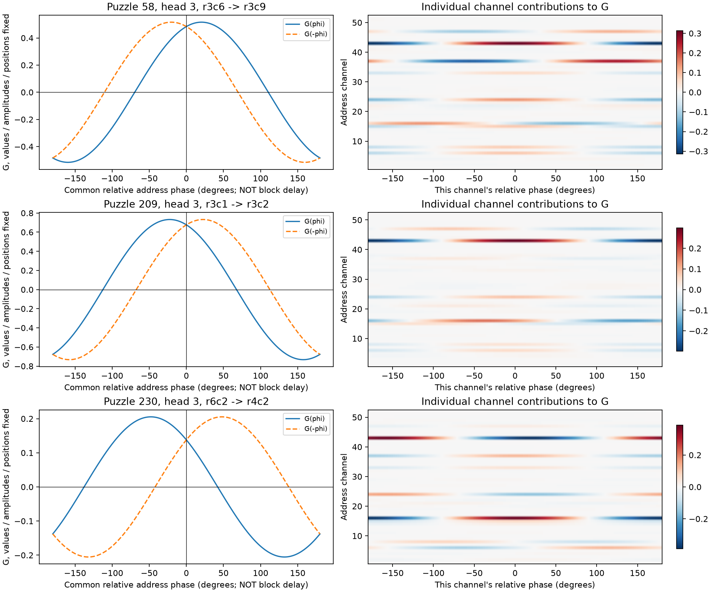
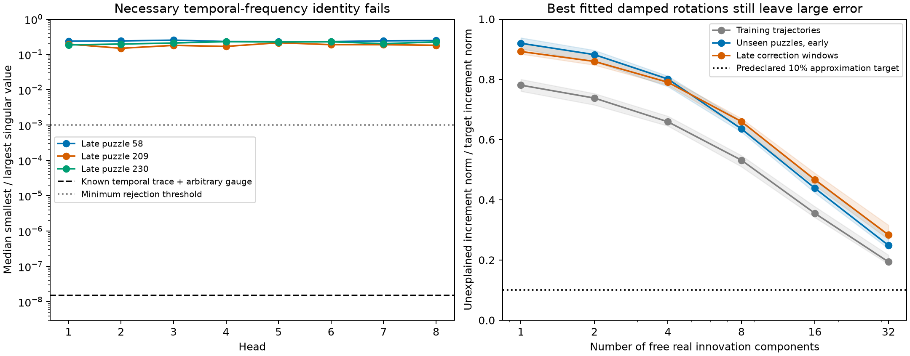
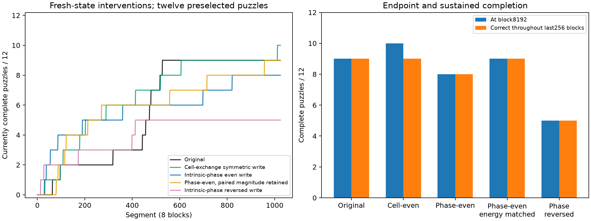
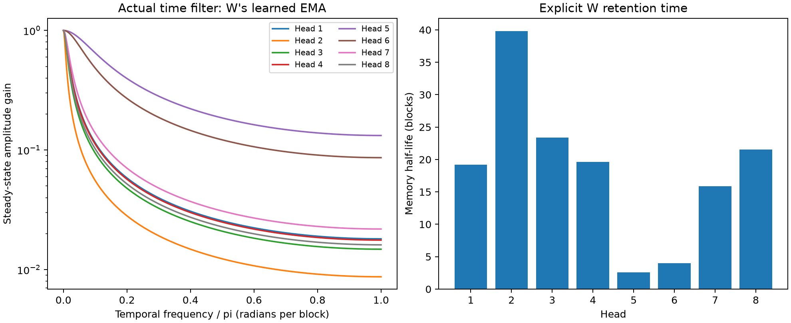

# v1.1의 위상 쓰기와 실제 시간주파수 대응

2026-09-26. 체크포인트 `checkpoints/v1.1_step160000.npz`.
SHA-256: `63f478a6563a9c8419db17bc1e44c223f364d1b3a2f2180e32fe4f1e02c9c0cd`.

**현재 쓰기 G에는 위상차에 따른 강화·약화가 있다. 그러나 현재 주소 채널을 실제 활동
이력의 지수감쇠 시간주파수 좌표로 읽는 문서의 가설은 관측된 재귀식의 필요조건과 맞지 않았다.**
또한 주소 위상차의 부호를 구분하는 쓰기를 제거한 조건에서도 기존의 세 후기 완답 사례를
모두 해결할 수 있었다. 이 결과들은 `위상에 따른 쓰기`와 `실제 시차에 따른 STDP`를 구분한다.

이번에는 hidden 벡터에 작은 수를 더하지 않았다. 위상 실험은 쓰기 연산에 들어가는
주소 위상만 바꿨다. 시간주파수 검사는 조작하지 않은 실제 풀이 궤적을 사용했다.

## 1. 위상차만 바꾸면 G가 어떻게 변하는가

현재 코드의 한 연결은 다음과 같다.

\[
G_{tn}=gD_{tn}\,agree_{tn}
\sum_j r_{t,j}r_{n,j}\cos(\delta_j+\chi_j+\beta_j),
\]

여기서 δ는 위치 회전 전 주소 위상차, χ는 고정된 위치 위상
`theta_j · (pos_t-pos_n)`이다.

값 벡터, agree, 주소 진폭, g, β, 위치를 모두 고정했다.
정규화된 복소 주소를 켤레로 바꾸면 같은 연결에서 δ만 −δ로 바뀐다.
생산 코드의 `attn_xy`로 직접 계산했고, 독립적인 채널 합과의 최대 오차는 1.78e−15였다.

기존 세 사례에서 선택해 두었던 3번 헤드 연결의 결과:

| 퍼즐·수정 | 연결 | 실제 위상의 G | 반전한 위상의 G |
|---|---|---:|---:|
| 58, 8→6 | r3c6→r3c9 | +0.483973 | +0.463608 |
| 209, 7→3 | r3c1→r3c2 | +0.674027 | +0.556320 |
| 230, 2→1 | r6c2→r4c2 | +0.961567 | +0.777042 |

세 연결 모두 강화가 유지됐다. 이 상태의 위상 반전은 강화→약화가 아니었다.
다른 위상으로 옮기면 부호 반전 구간도 있다. 예를 들어 모든 채널의 상대 위상을
같은 각도로 맞춘 단면에서 ±90°는 부호가 반대지만, ±30°는 세 사례 모두 양수다.
한 각도만 고르면 선호하는 결론을 만들 수 있으므로 전체 곡선을 저장했다.



**그림의 가로축은 위상각이다. 블록 시차 dt가 아니다.** 채널마다 동일한 각도를 넣은
단면은 `omega_j dt`라는 시간주파수 대응을 가정하지 않는다.
각 채널의 전체 반응 계수도 원자료로 저장해, 임의의 주파수를 사후에 골라 시간곡선을
만드는 해석을 피했다.

추가로 퍼즐 1의 152·192블록 상태에서 모든 헤드·비대각 연결을 측정했다.
위상 반전으로 부호가 바뀐 비율은 각각 28.25%, 12.39%였다.
이는 관측 위상과 그 반전 사이의 비교이며, 어느 쪽이 실제 선행 발화인지는 가정하지 않는다.

## 2. β만으로 시간 선호를 판단하면 안 되는 이유

두 연산은 다르다.

- 주소 위상차 반전: `delta→−delta`, 위치 χ 고정.
- 셀 교환: `delta→−delta`와 `chi→−chi`가 함께 일어남.

주소 위상차 반전에 대한 홀수 성분은

\[
G_{odd}^{phase}=-gD\,agree\sum_jr_tr_n\sin\delta_j\sin(\beta_j+\chi_j).
\]

셀 교환에 대한 반대칭 성분은

\[
G_{odd}^{cell}=-gD\,agree\sum_jr_tr_n\sin(\delta_j+\chi_j)\sin\beta_j.
\]

따라서 β≈0이어도 **고정된 위치를 둔 주소 위상 반전**에는 차이가 남는다.
세 연결에서 그 차이를 다시 분해하면 다음과 같다.

| 퍼즐 | 전체 위상 홀수 성분 | sin β에서 온 부분 | 위치 위상에서 온 부분 |
|---|---:|---:|---:|
| 58 | +0.010183 | −0.001492 | +0.011675 |
| 209 | +0.058854 | −0.004393 | +0.063246 |
| 230 | +0.092263 | +0.002699 | +0.089563 |

이 세 연결에서는 **고정 위치 위상과 주소의 관계가 차이의 대부분을 만들었다.**
실제로 공통 +90°를 넣은 같은 물리적 상태에서 정방향·역방향 G는 각각
`(+0.1797,+0.2592)`, `(-0.2798,-0.2314)`, `(-0.1522,-0.1749)`였다.
한쪽을 강화하고 반대쪽을 약화하는 규칙과 구분해야 한다.

## 3. 실제 시간주파수 대응을 검증한 방법과 결과

여러 주소 채널이 같은 활동의 시간 이력을 서로 다른 주파수로 표현한다면
어떤 활동 x인지 미리 정하지 않아도 다음 재귀가 성립해야 한다.

\[
Z_j(k+1)=\lambda_jZ_j(k)+b_jx(k+1),\quad \lambda_j=\rho_je^{-i\omega_j}.
\]

λ, b, x를 모두 미지수로 허용했다. 주소 정규화 때문에 틀리게 기각하지 않도록,
매 시점의 임의 공통 크기·위상 변화까지 허용한 더 넓은 식도 검사했다.

\[
z_j(k+1)=a(k)\lambda_jz_j(k)+b_jc(k).
\]

여기서 a와 c도 자유로운 복소수다. 이 식에서 a와 c를 소거하면, 세 채널로 만든
여섯 시간열 사이에 고정된 선형 관계가 반드시 남는다. 이 필요조건은 주파수를
추정하는 최적화의 성공 여부에 의존하지 않는다.
[유도와 판정 기준](phase_time_certificate_v11.md)을 별도로 남겼다.

실제 풀이를 FP32로 재현해 원래 예측과 **995,328개 셀·블록 비교에서 불일치 0**을
확인했다. 3개 퍼즐의 초기·후기 구간, 각 6셀, 8헤드, 고정된 56개 채널 묶음을 검사했다.

| 대상 | 시간주파수 필요조건 위반 |
|---|---:|
| 알려진 푸리에 흔적 + 임의 공통 크기·위상 변화 | 0 / 56 |
| 실제 v1.1 궤적, FP32 | **16,128 / 16,128** |
| 세 후기 표적 셀 재현, FP64 | **1,344 / 1,344** |

FP64 재현도 원래 퍼즐 예측과 불일치가 없었다.
예를 들어 58번 퍼즐의 표적 셀·3번 헤드·주소 채널 1,2,3에서 필요한 관계의
정규화 잔차를 나타내는 `sigma_min/sigma_max`는 0.24648이었다.
알려진 흔적의 대조 중앙값은 1.53e−8이었다.

활동을 여러 개로 넓혀도, 4채널에 최대 2개 활동 또는 6채널에 최대 4개 복소 활동을
허용한 조건은 각각 72/72 경우에서 위반했다. 보다 큰 모델의 결과와 제한은 유도 문서에 있다.

별도로 감쇠·회전과 입력 방향을 적합시켜 근사 가능성도 확인했다.
4개 퍼즐로 맞추고 다른 3개 퍼즐의 초기·후기 구간에 적용했을 때, 단일 활동 모형의
잔차 노름은 주소 변화량 노름의 **88.4–93.8%**였다. 미지 활동 크기를 매 시점 자유롭게
맞춰준 결과인데도 작은 오차의 대응은 아니었다. 이것은 예측 정확도가 아니라 구조 재구성 오차다.



**결론: 현재 주소 좌표를 문서의 고정된 지수감쇠 시간주파수 은행으로 동일시하는 가설을 기각한다.**
단순히 omega를 찾지 못했다는 결론이 아니다. 어떤 고정 omega·감쇠를 선택하더라도
그 가설이라면 만족해야 할 관계가 관측과 맞지 않는다.

모든 채널에 독립적인 미지 입력을 허용하면 어떤 omega도 잔차 정의로 만들어낼 수 있다.
그 경우는 시간주파수가 관측에서 식별된 것이 아니므로 성공으로 세지 않았다.
다른 잠재 좌표계나 일반적인 비선형 시간 정보까지 부정하는 검사는 아니다.

## 4. 위상차의 부호를 구분하는 쓰기가 실제 풀이에 필요한가

기존에 선택한 12개 퍼즐을 **초기 상태부터 8192블록**까지 다시 풀었다.
매 블록의 G만 변경하고, 원래 읽기 a_psi·값·MLP·eta·lambda는 유지했다.
처음부터 개입했으므로 예전 원본 W가 남아 결과를 대신해 주는 문제는 없다.

`Gm=G(conj(u))`, `E=(G+Gm)/2`, `O=(G-Gm)/2`로 쓴다.

| 조건 | 쓰기 목표 | 마지막 완답 | 마지막 256블록 연속 완답 |
|---|---|---:|---:|
| 원본 | G | 9/12 | 9/12 |
| 셀 교환 대칭 쓰기 | (G+Gᵀ)/2 | **10/12** | 9/12 |
| 주소 위상에 대해 짝수인 쓰기 | E | 8/12 | 8/12 |
| 위상 짝수 + 크기 보존 | sign(E)√(E²+O²) | 9/12 | 9/12 |
| 주소 위상 반전 쓰기 | Gm | 5/12 | 5/12 |

셀 교환 대칭 쓰기는 원본이 풀었던 9개를 모두 유지했다. 추가 1개는 8096블록부터
완답이므로 마지막 256블록 연속 완답에는 아직 포함되지 않는다.

크기 보존 조건은 단순한 E 제거 실험 뒤에 추가한 통제다. 이 식은 위상 반전에 대해
여전히 짝수이며, 원래 위상과 반전 위상에서의 쓰기 제곱 평균을 각 연결마다 보존한다.
E=0인 경우는 0으로 둔다. 단순히 쓰기 크기가 줄어서 생긴 실패를 위상차 부호 정보의
필요성으로 해석하지 않기 위한 후속 실험이다.

기존 세 후기 사례가 **그 뒤 관측 종료인 8192블록까지 완답을 유지한 최초 블록**:

| 퍼즐 | 원본 | 셀 교환 대칭 | 위상 짝수 | 위상 짝수·크기 보존 | 위상 반전 |
|---|---:|---:|---:|---:|---:|
| 58 | 4212 | 4842 | 692 | 1698 | 1377 |
| 209 | 3778 | 1624 | 434 | 702 | 218 |
| 230 | 3649 | 4152 | 6564 | 4459 | 3189 |

**세 후기 사례 모두, 위상차의 부호를 구분하지 않는 쓰기로도 해결됐다.**
58·209번은 원본보다 일찍, 230번은 늦게 정착했다. 크기 보존 조건의 9개 완답은
원본의 9개와 완전히 같지는 않다. 원본의 72번을 잃고 원본이 못 푼 147번을 풀었다.

수치 검산에서 정상 G와 반전 G의 FP32 곱셈 순서를 모두 `g*(attn_beta*agree)`로
통일했다. 위상 짝수 목표와 크기 보존 목표가 G·Gm 교환에 대해 비트 단위로 같은지도
확인했다. 통일 전에는 `g*agree*attn_beta`로 계산한 반전 G를 사용했으며,
위상 짝수·크기 보존·반전 조건의 완답은 각각 7·7·4개였다. 위 표는 통일 후 재현이다.
[초기 연산 결과](../runs/phase_timing_v11/write_ablation_initial_arithmetic/summary.json)도
보존했다. 두 계산은 실수 수학에서는 같지만 긴 FP32 궤적은 달라졌다.
따라서 개입이 개선을 보장한다거나 특정 완답 시점이 수치 정밀도에 강건하다고 주장하지 않는다.
기존 세 사례가 위상 부호를 구분하지 않는 쓰기로도 풀리는 관측은 두 계산에서 모두 남았다
(초기 계산에서는 크기 보존 조건, 최종 계산에서는 두 짝수 조건 모두).



이 표는 재학습이나 무작위 테스트셋의 성능 비교가 아니다. 기존 후기 퍼즐 12개에서
학습된 모델의 추론 중 특정 쓰기 성분이 필수인지 검사한 결과다.
빠른 읽기 경로는 계속 원본이며, 쓰기 대칭화가 모델 전체의 방향성을 없애지는 않는다.

## 5. 실제로 보장되는 시간 작용

현재 forward를 그대로 전개하면 주소의 정확한 재귀도 쓸 수 있다.
`q_k=h_k+MLP(h_k)+I`, `u_k=C q_k`, 읽은 메시지를 f_k라 하면

\[
h_{k+1}=s_k(q_k+f_k),\quad
s_k=(1+\|q_k+f_k\|^2/d)^{-1/2},
\]
\[
u_{k+1}=s_k u_k+s_kC f_k+C\,MLP(h_{k+1})+CI.
\]

세 후기 궤적에서 이 항등식을 FP64로 검산한 최대 오차는 2.14e−13이었다.
명시적 유지 경로의 s는 양의 실수이며 관측 범위는 0.169–0.516이었다.
이 경로 자체는 과거 주소를 회전시키지 않는다. 위상 변화는 읽기 메시지와 MLP 등
새로 들어오는 벡터 항에서 발생한다. 이 전개만으로 학습된 피드백의 유효 회전을
배제하지는 않으며, 그 가능성을 실제 시간 궤적의 필요조건으로 별도 검사한 것이 앞 절이다.

W에는 실제 블록 시간에 대한 명시적 필터가 있다.

\[
W_k=(1-\eta)W_{k-1}+\eta G_k,
\qquad H(\nu)=\frac{\eta}{1-(1-\eta)e^{-i\nu}}.
\]

| 헤드 | eta | W 반감기, 블록 | +a/−a 교대 신호의 정상상태 진폭 비율 |
|---|---:|---:|---:|
| 1 | 0.03551 | 19.17 | 1.81% |
| 2 | 0.01726 | 39.82 | 0.87% |
| 3 | 0.02917 | 23.41 | **1.48%** |
| 4 | 0.03468 | 19.64 | 1.76% |
| 5 | 0.23365 | 2.60 | 13.23% |
| 6 | 0.15890 | 4.01 | 8.63% |
| 7 | 0.04274 | 15.87 | 2.18% |
| 8 | 0.03169 | 21.52 | 1.61% |

같은 부호의 상수 G는 정상상태에서 100% 남는다.
따라서 **G가 시간에 따라 +a/−a로 교대하면 W에서 크게 약화되고, 지속적인 성분은 남는다**는
주장은 이 모델에서 수학적으로 맞다. 이것은 절대 블록 시간에 대한 누수 적분의 성질이며,
pre/post 발화 시차의 부호로 강화·약화를 나누는 성질과는 구분된다.
지속적인 관계가 정답에 유익한 관계라는 보장은 이 필터 식만으로 나오지 않는다.



## 판정

| 명제 | 이번 결과 |
|---|---|
| G는 위상차에 따라 부호·크기가 달라진다 | 확인 |
| β≈0이면 위치 고정 위상 반전에도 아무 차이가 없다 | 반박 |
| 현재 주소가 같은 활동의 고정 시간주파수 이력을 표현한다 | 필요조건 위반으로 기각 |
| 기존 세 후기 풀이에 위상차의 부호를 구분하는 쓰기가 반드시 필요하다 | 위상 짝수 쓰기 개입으로 반박 |
| W는 빠른 부호 교대를 감쇠하고 지속적인 쓰기를 남긴다 | 학습된 eta로 정량 확인 |
| 외삽 향상 전체가 위 STDP 시차 규칙 때문이라고 설명할 수 있다 | 이번 결과는 그 설명을 지지하지 않음 |

지금 확인된 작용은 **현재 내용·주소·위치로 계산한 부호 있는 관계를 W가 시간에 걸쳐
평활하고, 그 W로 현재 값을 다시 읽는 과정**이다. 이 과정의 유효성은 실제 시간주파수
STDP 대응이 성립해야만 가능한 것이 아니다.

## 재현과 원자료

저장된 baseline과 체크포인트가 있는 프로젝트 루트에서 실행한다.

```bash
python lt/probe_phase_timing_v11.py
python lt/capture_address_time_v11.py
OPENBLAS_NUM_THREADS=2 OMP_NUM_THREADS=2 python lt/analyze_address_time_v11.py
OPENBLAS_NUM_THREADS=2 OMP_NUM_THREADS=2 python lt/probe_projective_time_v11.py
OPENBLAS_NUM_THREADS=2 OMP_NUM_THREADS=2 python lt/probe_multi_drive_time_v11.py
python lt/audit_address_time_v11.py
python lt/probe_phase_write_ablation_v11.py
python lt/plot_phase_timing_research_v11.py
```

- [위상 개입 결과](../runs/phase_timing_v11/phase_summary.json)
- [실제 궤적 캡처·재현 검증](../runs/phase_timing_v11/time_data/summary.json)
- [정규화 불변 시간 필요조건](../runs/phase_timing_v11/projective_time/summary.json)
- [근사 흔적 적합](../runs/phase_timing_v11/time_analysis/fit_summary.json)
- [여러 활동을 허용한 검사](../runs/phase_timing_v11/multi_drive_time/summary.json)
- [FP64 검산·정확한 주소 재귀](../runs/phase_timing_v11/fp64_audit/summary.json)
- [처음부터의 쓰기 개입](../runs/phase_timing_v11/write_ablation/summary.json)

각 디렉터리에 사전 판정 기준, 원자료, 코드에서 재계산할 수 있는 수치가 있다.
앞서 수행한 hidden 0.1%/0.2% 짝자극 결과는 이번 STDP 시차 판정의 근거로 사용하지 않았다.
