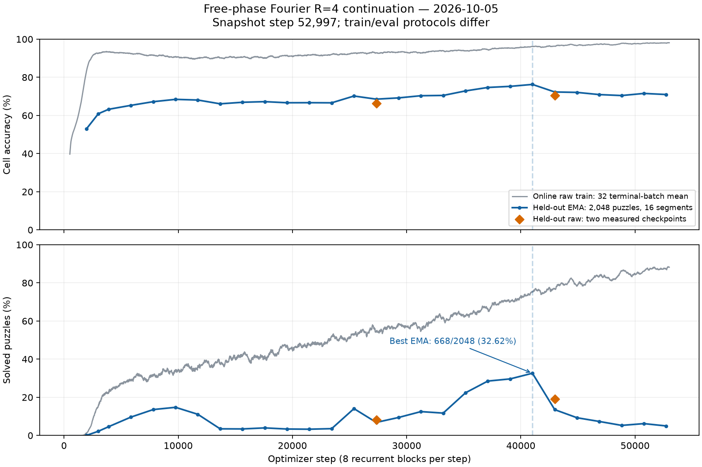

# 자유위상 사인 4성분 모델의 전체 일정 재개

사용자 요청에 따라 2026-10-05 08:04:11 UTC에 3,008스텝 checkpoint에서
같은 모델의 학습을 재개했다. 연구 대조군의 원본 로그·설정은
[연구 보고서 자료](2026-10-05/free_phase_window_research/REPORT.md)에 보관되어 있다.

- 실행 디렉터리: `runs/research_free_phase_free_fourier4_e05_20261005`
- 모델: 자유로운 순서, 토큰별 채널 gain, 사인 4성분, epsilon=0.5
- 정밀도: 기존 BF16 본체 / FP32 위상·특징·메모리
- 설정: seed0, batch128, hidden832, 8heads, 8blocks/segment, 16segments
- 전체 일정: 기존 50,000epochs, 실제 종료 예정 optimizer step 390,600
- 별도 step/time 제한: 없음 (`max_steps=null`, `max_hours=null`)
- 저장: 1,000스텝 간격 및 기존 평가 경계, 최근 3개만 유지
- 최초 재개 PID: 23333

원래 trainer의 strict resume 경로로 raw weights, optimizer, EMA, carry, RNG,
데이터 cursor를 복원했다. raw weights와 EMA는 실제 복원된 전체 tensor를 원본
checkpoint와 비교하여 정확히 일치함을 추가 확인했다. 학습률은 1e-4로 이어지며
warmup을 다시 시작하거나 모델 구조·창·연산 정밀도를 바꾸지 않았다.

재개 직후 확인 시점은 3,788스텝이었다. 새 780개
스텝의 기록된 손실이 모두 finite였고, 최근 128스텝 중앙값은
0.12205초/스텝이었다. 마지막 16개 종료 배치의
평균 훈련 칸 정확도는 93.41%, 완전 정답률은
23.10%였다. 진행 중인 학습의 시점 기록이며
전체 일정 완료나 새로운 test 평가를 뜻하지 않는다.

재개 진입점은 [resume_free_phase_windows.py](../../lt/resume_free_phase_windows.py)다.
이 명령은 해당 디렉터리의 최신 checkpoint와 저장된 protocol을 사용한다.
로그/체크포인트 step이 다르면 자동으로 진행 기록을 덮어쓰지 않고 중단한다.

```bash
python -u -m lt.resume_free_phase_windows \
  --run runs/research_free_phase_free_fourier4_e05_20261005 \
  --steps 0 --save-every 1000 --keep-last 3
```

위 명령은 이미 실행 중이다. 동시에 재실행하지 않는다. 진입점의 파일 잠금이
같은 런의 중복 재개를 차단한다. 콘솔은 `continue.log`, step별 손실·속도·종료 배치
정확도는 `train.jsonl`, 시작 및 종료 상태는 `resume_status.json`에 기록한다.
이전 설정·종료 기록과 재개 코드 snapshot은 런의 `continuations/`에 보존한다.
학습 checkpoint는 Git에 포함하지 않는다.

## 후속 관측: 52,997스텝까지의 기록

**스냅샷 시각: 2026-10-05 09:56:02 UTC.** 이 문서는 해당 시점까지의 기록이고,
학습은 계속 실행 중이다. 직전 연구 보고서의 3,008스텝 결과와 종료 상태는
이 전체 일정 재개 이전의 기록이다.

재개 후 9,765스텝 EMA 완전 해결률이 14.75%에 도달한 뒤 3%대로 하락했다.
25,389스텝부터 반등과 변동을 거쳐 41,013스텝에서 **668/2,048, 32.62%**로
새 최고점을 기록했다. 이후 다시 하락했고, 최신 52,731스텝 평가는
**102/2,048, 4.98%**, 셀 정확도 **70.98%**다. 초기 학습이 가능했다는 결과와
긴 학습에서 성능이 안정적으로 유지된다는 주장은 구분한다.

동시에 최근 종료 배치 32개(52,496–52,992스텝)의 online raw 훈련 정확도는
셀 **98.11%**, 완전 정답 **88.21%**, 평균 lm_loss **0.06985**였다.
이는 학습 중 바뀌는 raw 가중치·기존 carry·훈련 퍼즐의 지표다. EMA 고정 가중치와
fresh carry를 쓰는 held-out 평가와 조건이 달라, 두 수치의 차이만으로
과적합의 원인이나 EMA의 책임을 확정하지 않는다.



그림의 훈련선은 종료 배치 32개의 이동 평균이다. `_count_raw=0`인 중간 segment의
accuracy=0은 자리표시 값이므로 제외했다. raw held-out 두 점은 별도 평가이며,
그 사이에 측정하지 않은 raw 성능 곡선을 보간하지 않았다.

## 전체 EMA eval 이력

모든 행은 같은 held-out **2,048문제**, **16segments × 8blocks = 128blocks**다.
문제별 carry를 배치마다 새로 만들며 조기 종료를 사용하지 않는다. 본체는 CUDA
BF16 AMP, 위상·특징·메모리는 FP32, FP32 matmul precision은 `highest`다.
학습의 한 optimizer step은 8블록짜리 segment 하나이며, 평가의 16segments와
구분해야 한다. 셀 정확도는 콘솔의 소수 네 자리 값을 옮긴 것이고 해결 개수는
정확한 정수다. 원문은 [eval_lines.log](2026-10-05/continuation_audit/eval_lines.log),
구조화 자료는 [eval_history.json](2026-10-05/continuation_audit/eval_history.json)에 있다.

| 스텝 | 셀 정확도 | 완전 해결 수 | 완전 해결률 |
| ---: | ---: | ---: | ---: |
| 1,953 | 52.88% | 0/2,048 | 0.00% |
| 3,008 | 60.91% | 45/2,048 | 2.20% |
| 3,906 | 63.23% | 94/2,048 | 4.59% |
| 5,859 | 65.30% | 197/2,048 | 9.62% |
| 7,812 | 67.22% | 278/2,048 | 13.57% |
| 9,765 | 68.44% | 302/2,048 | 14.75% |
| 11,718 | 68.09% | 227/2,048 | 11.08% |
| 13,671 | 66.10% | 71/2,048 | 3.47% |
| 15,624 | 66.91% | 70/2,048 | 3.42% |
| 17,577 | 67.24% | 81/2,048 | 3.96% |
| 19,530 | 66.66% | 69/2,048 | 3.37% |
| 21,483 | 66.69% | 67/2,048 | 3.27% |
| 23,436 | 66.63% | 73/2,048 | 3.56% |
| 25,389 | 70.19% | 288/2,048 | 14.06% |
| 27,342 | 68.55% | 140/2,048 | 6.84% |
| 29,295 | 69.21% | 193/2,048 | 9.42% |
| 31,248 | 70.35% | 256/2,048 | 12.50% |
| 33,201 | 70.50% | 240/2,048 | 11.72% |
| 35,154 | 72.87% | 458/2,048 | 22.36% |
| 37,107 | 74.68% | 584/2,048 | 28.52% |
| 39,060 | 75.26% | 607/2,048 | 29.64% |
| 41,013 | 76.27% | 668/2,048 | 32.62% |
| 42,966 | 72.31% | 277/2,048 | 13.53% |
| 44,919 | 72.09% | 190/2,048 | 9.28% |
| 46,872 | 70.94% | 150/2,048 | 7.32% |
| 48,825 | 70.44% | 108/2,048 | 5.27% |
| 50,778 | 71.55% | 127/2,048 | 6.20% |
| 52,731 | 70.98% | 102/2,048 | 4.98% |

## 같은 체크포인트의 raw/EMA 비교

사용자가 EMA에서 제외할 파라미터의 가능성을 제기해 먼저 전체 raw 가중치를
평가했다. checkpoint의 `raw_model_state_dict`와 `model_state_dict`를 각각
strict load하고, 후자가 저장된 `ema_shadow`와 일치하며 EMA 밖 tensor가
동일한지 확인했다. 원래 trainer의 `evaluate` 함수를 그대로 사용했다.
GPU 여유 메모리에서 별도 프로세스로 평가했고 학습은 계속 진행했다.

| 스텝 | 가중치 | 셀 정확도 | 완전 해결 수 | 완전 해결률 | lm_loss |
| ---: | --- | ---: | ---: | ---: | ---: |
| 27,342 | Raw | 66.42% | 169/2,048 | 8.25% | 0.81403 |
| 27,342 | EMA | 68.55% | 140/2,048 | 6.84% | 0.73946 |
| 42,966 | Raw | 70.51% | 390/2,048 | 19.04% | 0.76862 |
| 42,966 | EMA | 72.31% | 277/2,048 | 13.53% | 0.67102 |

EMA 재평가의 셀 정확도(콘솔 정밀도)와 해결 수는 기존 로그와 일치했다.
Raw는 각각 **29개(+1.42%p)**, **113개(+5.52%p)** 더 해결했지만, 두 시점 모두
셀 정확도와 lm_loss는 EMA보다 나빴다. 평가 지표에 따라 우열이 달라지는 결과이며,
EMA를 통째로 제거하거나 특정 위상 파라미터만 제외해야 한다는 결론은 아니다.

특히 **41,013스텝 최고점의 raw가 없어 최근 급락이 raw에서도 발생했는지는
확인하지 못했다.** 최근 3개만 유지하는 정책으로 해당 checkpoint가 정리됐고,
42,000/42,966 비교를 준비하는 사이 42,000도 정리되어 해당 비교는 실행되지 않았다.
남아 있는 동일 시점 42,966의 raw/EMA 평가를 완료했다. 27,342→42,966의 raw
해결률 상승만으로 최고점 전후의 raw 추세를 복원해서는 안 된다.

평가 도구는 [evaluate_free_phase_raw_ema.py](../../lt/evaluate_free_phase_raw_ema.py)다.
checkpoint를 한 번 CPU에 읽은 뒤 두 평가에 재사용하며, 디스크에 모델 사본을
추가로 저장하지 않는다. 아래 명령은 당시 checkpoint가 남아 있을 때만 재실행할 수 있다.

```bash
python -u -m lt.evaluate_free_phase_raw_ema \
  --run runs/research_free_phase_free_fourier4_e05_20261005 \
  --checkpoint runs/research_free_phase_free_fourier4_e05_20261005/step_42966.pt
```

원본 평가 metadata에 checkpoint SHA256, 데이터 fingerprint, 정밀도, 설정과
문제 수를 보관했다. 자료:
[27,342 metadata](2026-10-05/continuation_audit/raw_vs_ema_step27342_20261005T090014Z/metadata.json),
[결과](2026-10-05/continuation_audit/raw_vs_ema_step27342_20261005T090014Z/results.json),
[42,966 metadata](2026-10-05/continuation_audit/raw_vs_ema_step42966_20261005T093601Z/metadata.json),
[결과](2026-10-05/continuation_audit/raw_vs_ema_step42966_20261005T093601Z/results.json).

## Weight decay와 EMA 대상 확인

대화 중 22,000스텝 checkpoint에서 optimizer group을 확인했고, 문서화할 때
52,731스텝 checkpoint로 그룹과 EMA 포함 여부를 다시 확인해
[optimizer_groups.json](2026-10-05/continuation_audit/optimizer_groups.json)에 보관했다.
후자의 수치 크기는 22,000스텝 측정값이 아니라 **52,731스텝**의 값이다.

| 파라미터 | Weight decay | EMA | 해석 |
| --- | ---: | --- | --- |
| Q/K/V, 출력 사영, FFN, token embedding, readout 행렬 | 1 | 포함 | 주요 행렬이 전부 decay에서 빠진 상태가 아님 |
| `phase_local_gain` (1,664개) | 1 | 포함 | 상태 의존 위상 gain도 decay 적용 |
| 공간 RoPE `theta` (832개) | 0 | 포함 | 공간 위상과 관련된 학습 파라미터 |
| `theta_k_raw`, `theta_v_raw` (각 832개) | 0 | 포함 | K/V 기본 위상 offset |
| `w_cls.bias` (11개) | 0 | 포함 | readout bias |
| `trace_lam_raw` (416개) | 0 | 포함 | 현재 forward에서 미사용, 저장된 Adam state도 없음 |
| puzzle embedding | 별도 SignSGD에서 1 | EMA shadow 밖 | puzzle identifier는 하나이며 퍼즐별 lookup이 아님 |

EMA rate는 **0.999**다. decay 제외는 `ndim<=1`, 이름 및 설정에 따른 기존
trainer 규칙이며, 별도의 EMA 제외 목록과 동일하지 않다. 사용하지 않는 trace
파라미터를 활성 학습의 과적합 원인으로 지목할 근거는 없다.

위상 관련 파라미터의 decay 제외가 일반화 저하에 기여할 가능성은 가설로 남는다.
theta에 일반적인 zero-centered decay를 추가하면 위상·위치 표현 자체를 0으로
수축시키므로 초기값 대비 변화량 제약 등과도 구분해야 한다. 이번에는 decay 변경,
파라미터별 EMA 혼합 교체, EMA rate 변경 또는 재학습 대조 실험을 하지 않았다.
따라서 어느 특정 파라미터가 원인인지 판정하지 않는다.

## 실행 시간과 보관 정책

로그의 50,000스텝 `elapsed`는 **6,745.949551초 = 1시간 52분 25.95초
(약 1.87시간)**다. 최초 3,008스텝의 439.688301초와 재개 뒤 50,000스텝까지의
6,306.261250초를 합친 누적 실행 시간이다. 초기 compile, 정기 eval, checkpoint
저장 및 동시 진단의 연산 경쟁이 포함되고, 3,008스텝 후 중단되어 있던 대기 시간은
제외된다. 순수 GPU 연산 시간이나 최초 시작부터의 달력상 경과 시간이 아니다.
최신 512스텝의 중앙값은 **0.12201초/스텝**이다.

전체 일정은 여전히 390,600 optimizer steps이며 `max_steps=null`,
`max_hours=null`이다. 50,000은 이번 시간 확인 지점이지 종료 제한이 아니다.
checkpoint는 1,000스텝 및 평가 경계에서 저장하고 최근 3개를 유지한다.
best checkpoint를 별도로 영구 보관하는 설정은 없으므로 과거 최고점의 가중치를
나중에 재평가하지 못할 수 있다. 로그와 이번에 보관한 scalar 자료는 유지한다.

## 보관 자료와 검증

자료는 [continuation_audit](2026-10-05/continuation_audit/)에 고정했다. 원래 연구
대조군 자료를 덮어쓰지 않았으며 모델 checkpoint를 추가 복사하거나 Git에 넣지 않았다.

- `summary.json`: UTC 시각, cutoff, 입력 로그 prefix SHA256, milestone 원문과 집계 기준.
- `train_terminal_metrics.csv`: 52,997스텝까지의 모든 종료 배치 scalar. 중간 segment의 0 정확도 제외.
- `eval_history.json`, `eval_lines.log`: 최초 연구 평가부터의 전체 EMA eval.
- `raw_vs_ema_step*/`: 두 동일 checkpoint 비교의 원본 metadata와 결과.
- `optimizer_groups.json`: CPU strict load 후 실제 저장 optimizer group과 EMA 대상 확인.
- `config.json`, `protocol.json`, `resume_status.json`: 당시 실행 설정과 상태 사본.
  `protocol.json`의 짧은 연구 제한 설명은 초기 대조군 기록이며,
  전체 일정 재개 상태는 `config.json`과 `resume_status.json`을 따른다.
- `learning_curves.png`, `learning_curves.svg`: 보관 scalar만으로 생성한 그림.
- `regression_tests.log`: 오늘 추가된 아키텍처와 관련 기존 경로의 CPU 회귀 테스트 **48개 통과**.

실제 forward의 두 residual RMSNorm 위치·횟수·FP32 제곱 평균·eps=1e-5·affine 없음,
창의 위치, 전체 gradient, local warp의 순서 보존, 자유위상의 순서 반전,
저장/재개와 최근 3개 보관 등을 해당 테스트로 확인했다. 이번 정리에서 새 GPU 학습
실험은 실행하지 않았으며, 이전 GPU preflight/gradient 검산 결과는 연구 보고서에 있다.

```bash
OMP_NUM_THREADS=2 OPENBLAS_NUM_THREADS=1 python -m unittest \
  lt.test_phase_puzzle_exp_current lt.test_phase_channel_exp_current \
  lt.test_phase_channel_gram_exp_current lt.test_phase_local_warp_exp_current \
  lt.test_phase_exp_current lt.test_unit_phase_current lt.test_phase_current \
  lt.test_free_phase_windows -v

# matplotlib와 numpy가 필요하다. live run/checkpoint는 필요하지 않다.
python -m lt.plot_free_phase_continuation --output /tmp/free_phase_continuation_plot
```

현재의 결정은 **구조·EMA·decay를 바꾸지 않고 학습을 계속 관찰**하는 것이다.
재귀 중 형성되는 사인 성분으로 창을 합성한다는
[별도 논제](2026-10-05-recurrent-window-synthesis-proposal.md)는 아직 구현하지 않았다.
