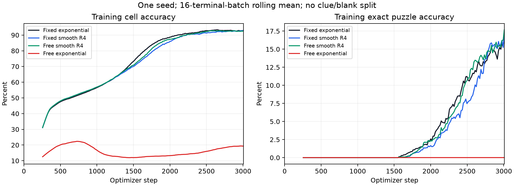
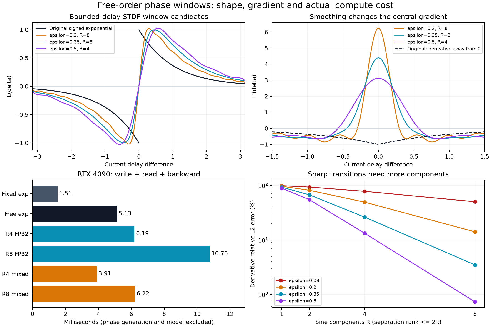
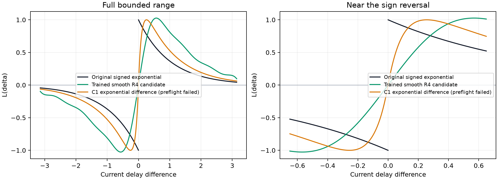

# 자유롭게 순서가 바뀌는 상태 의존 위상과 STDP 창 연구

2026-10-05 UTC. 주요 연구·GPU 실험: 06:16–07:16. 이후 로그 정리, 재현 확인과 보고서 작성.

**현재 가장 유망한 구현은 토큰별 채널 활동으로 위상을 만들고, 매끄러운 STDP 모양을
사인 4성분으로 표현하는 방식이다.** 같은 조건의 3,008스텝 대조 실험에서 자유위상
사인 창은 훈련 칸 정확도 92.57%, 기존 고정 지수형은 92.99%였다. 같은 자유위상
생성기에 불연속 지수 창을 쓴 대조군은 18.83%였다. 사인 모델에서 상태에 따른 실제
순서 반전도 확인했다. 다만 FP32 전체 학습은 고정 지수형의 약 1.83배 시간이 걸렸고,
단일 seed의 짧은 실험이므로 성능 우위나 장기 안정성을 입증하지는 않았다.

이 연구는 원래 불연속 창을 그대로 저비용 GEMM으로 구현하는 문제를 해결한 것이
아니다. 창 자체를 바꾸면서 자유로운 순서와 학습 가능성을 함께 유지하는 후보를
찾은 것이다. 지수 꼬리를 정확히 보존하는 추가 후보도 검토했지만 전체 모델 사전
검증에서 실패했으며, 아래에 실패 과정까지 기록했다.



## 연구 범위와 실행 상태


UTC 06:16부터 문헌, 수학적 분해, 실제 GPU 기울기·속도, 짧은 학습 대조 실험을
진행했다. 중간에 사용자가 기존 학습 중지를 허용하여 순서 보존 warp 런을
**30,550스텝**에서 정상 종료하고 마지막 체크포인트를 보존했다. 기존 런을
자동 재개하지 않는다. 아래 새 실험의 3,008스텝 제한은 연구용 대조 실험에만
적용하며 기존 전체 epoch 설정을 바꾸지 않는다.

## 무엇이 불가능하고 무엇이 가능한가

목표 연산은 각 토큰의 쓰기에 그 토큰의 현재 위상차 창을 적용하는 것이다.

```text
delta[n,i,j] = phiV[n,i] - phiK[n,j]
G[i,j] = mean_n V[n,i] * RoPE(K)[n,j] * L(delta[n,i,j])
read = RoPE(Q) @ G.T
```

`L(a-b)=sign(a-b)*exp(-abs(a-b))`를 고정된 소수의 독립 특징
`sum_r f_r(a)g_r(b)`로 모든 연속 위상에 대해 정확히 표현할 수는 없다.
서로 다른 b를 가진 함수들은 서로 다른 위치 a=b에서 점프한다. 이 함수들의
선형 결합이 0이면 각 점프의 계수도 0이어야 하므로 임의 개수의 선형 독립
함수를 만들 수 있다. 이는 **유한한 고정 분리 rank의 한계**이며, 모든 빠른
알고리즘이 불가능하거나 6배 감속이 하한이라는 뜻은 아니다.

정확한 대안은 위상별 정렬 후 양방향 지수 누적합이다. 한 쓰기 토큰 n과
읽기 query q에 대해 다음 식이 성립한다.

```text
A(x) = sum_{j:phiK_j<x} q_j K_j exp(phiK_j/tau)
B(x) = sum_{j:phiK_j>x} q_j K_j exp(-phiK_j/tau)
y_i = V_i [exp(-phiV_i/tau) A(phiV_i)
           - exp(phiV_i/tau) B(phiV_i)]
```

이를 모든 쓰기 토큰에 평균하면 원래 read와 정확히 같다. tie는 두 합에서
제외한다. 임의 정렬에서 각 삼각 영역은 rank 1 구조를 갖는다. 이 구조는
[celerite의 지수 커널/semiseparable 연산](https://arxiv.org/abs/1703.09710),
[Hydra의 양방향 quasiseparable mixer](https://arxiv.org/abs/2407.09941)와
연결된다. 다만 여기서는 **토큰마다 채널 순서가 다르고 모든 query를 읽으므로**
그 논문의 속도가 그대로 적용되지 않는다. 단순 scan 구현은 이 저장소의 기존
벤치마크에서 이미 느렸으며 이번 연구에서 빠른 scan kernel을 완성한 것은 아니다.

## 매끄러운 창을 사인 특징으로 분해

다음 창을 자체 구성하고 bounded-delay 구간 `delta in [-pi,pi]`에 근사했다.

```text
rho = sqrt(delta^2 + epsilon^2)
L_epsilon(delta) = C * delta/rho * exp(-rho/tau), tau=1
L_R(delta) = sum_r c_r sin(omega_r delta)
```

C는 목표 창의 최대 절댓값을 1로 맞춘다. 따라서 원래 창과 중앙부뿐 아니라
전체 gain도 달라진다. 주파수와 계수는 창 값, 1차 미분 오차, 부호 위반을 함께
고려하여 사전에 맞추고 학습 중 고정했다. 정수 주파수만 쓰면 ±pi에서 창이
강제로 0이 되므로 주파수도 최적화했다. 유한 사인합은 무한대에서 감쇠하지
않으며 **위상을 제한한 구간에서만** STDP 모양을 근사한다.

삼각함수 차 공식에 의해 아래 쓰기는 선택한 `L_R`에 대해 정확하다.

```text
G = mean_n sum_r c_r [
      (V_n * sin(omega_r phiV_n)) outer (K_n * cos(omega_r phiK_n))
    - (V_n * cos(omega_r phiV_n)) outer (K_n * sin(omega_r phiK_n)) ]
```

R개의 토큰 특징을 이어 붙이면 길이 `R*T`인 두 GEMM으로 계산할 수 있다.
위상 순서 제한, 전체 퍼즐 pooling, 토큰 사이 phase write 재배분은 없다.
다만 **GEMM 횟수가 둘이라고 계산량이 기존 두 GEMM과 같지는 않다**.
내적 길이와 특징 메모리가 R배 늘어난다.

STDP의 위상차 창을 Fourier 성분으로 표현하고 단일 성분과 여러 성분을
비교한 직접적인 선행 연구는
[Duchet, Bick, Byrne (2023), §2.3와 Figure 4](https://pmc.ncbi.nlm.nih.gov/articles/PMC10422128/)다.
그 논문은 진동자/평균장 동역학을 다루며, 이번 KV 분해나 학습 속도를 입증하는
논문은 아니다. [Dao et al. (2017)의 deterministic kernel features](https://arxiv.org/abs/1709.02605)는
주파수 선택과 수치적분의 관련 참고문헌이다. 그 논문의 양의 정부호 커널에 대한
보장을 홀수 반대칭인 본 창에 직접 적용하지 않았다.

수치 비교에서 epsilon=0.35, R=8은 scalar 창 RMSE 0.00238, 미분 상대 L2
오차 3.48%였다. 반면 R=4는 미분 오차 26.17%였다. epsilon=0.5로 전환부를
넓히면 R=4에서 창 RMSE 0.01422, 미분 상대 오차 13.24%로 줄었다.
기존 학습 모델에서 추출한 두 블록의 K/V를 사용한 probe에서 epsilon=0.5,
R=4의 read 상대 오차는 약 5.4~5.6%, 위상 gradient 오차는 약 7.4~9.2%였다.
이는 **매끄러운 목표 창 대비 근사 오차**이며, 원래 불연속 창과의 오차가 아니다.
epsilon=0.35/R=8, epsilon=0.5/R=4 등은 양의 시차에서 음수가 되지 않는 것을
작은 시차의 해석적 부호와 전역 미분 상한을 이용한 격자 사이 하한으로 확인했다.

## 구현과 GPU에서 발견한 문제

일반 broadcast/concat 구현은 CPU 값·전체 기울기 검산을 통과했지만 설치된
PyTorch 2.11/CUDA 12.8의 컴파일 경로에서 **V 기울기가 틀렸다**. 같은 GPU의
eager 결과와 compiled 결과를 비교해도 V gradient 상대 오차가 약 100%였다.
이 문제는 이번 신규 특징 구현의 검증 중 발견한 것으로, 이전 학습이 이 오류를
사용했다는 증거는 없다. 해당 구현은 연구 모델에서 사용하지 않았다.

정확한 해석적 backward를 별도로 구현한 뒤, 출력 및 Q/K/V/두 위상 gradient를
CPU FP64 직접 pair 합산과 비교했다. 실제 batch128/head8/T81/D104 GPU에서
FP32 상대 오차는 대략 2e-7~6e-7이었다. BF16 특징 GEMM/FP32 출력·위상 계산
경로도 추가했으며, 같은 FP64 참조 대비 출력·gradient 상대 오차는 약 0.2%였다.
BF16 경로는 별도 수치 근사이며 FP32와 동일한 연산 정밀도라고 설명하지 않는다.
단순히 TF32 허용을 켠 비교에서는 이 shape의 뚜렷한 속도 개선이 없었다.

RTX 4090, batch128, head8, T81, D104, write+read+전체 backward:

| 연산 | FP32 시간 | 추가 peak allocated memory |
| --- | ---: | ---: |
| 고정 지수 창 | 1.51 ms | 249 MiB |
| 자유 순서 정확한 지수 창 | 5.13 ms | 273 MiB |
| 매끄러운 창 직접 pair 계산 | 18.32 ms | 7,117 MiB |
| 사인 4성분, 검증한 backward | 6.19 ms | 834 MiB |
| 사인 8성분, 검증한 backward | 10.76 ms | 1,626 MiB |

별도 BF16 특징 실험에서는 4성분 3.91ms, 8성분 6.22ms였다. 같은 pass의 고정
기준은 1.40ms였다. 위상 생성, 본체 사영·FFN·norm·optimizer는 이 표에 포함되지
않는다. 모델 전체 학습 시간을 별도로 기록했다.

## 짧은 학습 대조군

R=4, epsilon=0.5는 위 scalar 오차·부호·속도에 따라 3천 스텝 결과를 보기 전에
선택했다. 위상 생성기는 다음처럼 token/head/channel별 활동을 사용한다.

```text
phiK[n,j] = (pi/2) * tanh(thetaK[j] + aK[j] * RoPE(K)[n,j])
phiV[n,i] = (pi/2) * tanh(thetaV[i] + aV[i] * V[n,i])
```

두 a는 0으로 초기화하며, 채널·역할·헤드마다 독립 학습한다. 상태에 따른 순서
반전이 가능하고 어떤 공통 단조 warp도 강제하지 않는다. 대신 위상 사영이 활동
사영에 채널 gain으로 묶이는 표현력 제한은 있다. dense 독립 위상 head의 효율을
입증한 실험이 아니다. K/V 본체, 공간 RoPE, optimizer, seed0, batch128,
hidden832, 8블록/segment, 16segments, warmup2000을 유지했다. 본체의 attention
residual과 FFN residual 직후에 affine-free FP32 RMSNorm(eps=1e-5)을 각각
적용하는 실제 forward를 독립 참조식과 검산했다.

실제 3,008스텝에서 종료된 마지막 32개 segment-16 배치(2,512~3,008스텝)의
평균이다. 같은 창 고정/자유 비교가 상태 의존성에 대한 직접 대조군이다.

| 모델 | 훈련 칸 정확도 | 훈련 완전 정답률 | 초/step 중앙값 |
| --- | ---: | ---: | ---: |
| 기존 고정 지수 창 | 92.99% | 15.06% | 0.06694 |
| 기존 순서 보존 warp | 92.86% | 14.23% | 0.09789 |
| 사인 4성분 창, 고정위상 | 92.66% | 15.50% | 0.06761 |
| 사인 4성분 창, 자유위상 | 92.57% | 15.67% | 0.12215 |
| 원래 지수 창, 같은 자유위상 생성기 | 18.83% | 0.00% | 0.22965 |

64개 종료 배치 평균에서도 사인 창 고정/자유의 칸 정확도는 91.74%/91.93%,
완전 정답률은 10.73%/11.79%였다. 단일 seed의 초기 학습이며 장기 성능 개선의
증거는 아니다. 두 새 실험의 3,008스텝 EMA test 정확도는 각각 60.23%와 60.91%,
완전 정답 수는 38/2048와 45/2048였다. 자유위상 지수형의 EMA test 정확도는
14.33%, 완전 정답 수는 0/2048였다. 콘솔의 test 칸 정확도는 소수 네 자리 기록이다.

모든 새 대조군은 같은 데이터, seed와 위상 gain 초기값으로 실행했다. 고정 지수형과
순서 보존 warp의 수치는 이전 런에서 동일 스텝 구간을 추출한 것이며, 이번에 다시
학습한 대조군은 아니다. 시간은 마지막 512개 optimizer step의 중앙값이다.
8블록을 학습하는 한 segment가 한 step이며 16개 segment마다 종료 배치 정확도가
기록된다. `_count_raw=0`인 중간 segment의 정확도 0은 집계에서 제외했다.

세 신규 런 모두 3,008스텝을 정상 완료했다. 주기적 step 저장은 껐지만 trainer는
평가 경계와 종료 시점에 저장하므로 각 런에 1,953/3,008스텝 체크포인트가 남았다.
`keep_last=3`을 유지했고 모델 체크포인트는 Git에 넣지 않았다. 현재 학습 프로세스는 없다.

학습한 자유위상 모델을 CPU FP32로 두 학습 퍼즐에서 16segments 전개한 마지막
블록에서는 현재 theta 기준과 반대 순서인 pair/token이 약 **0.806%**였다.
토큰에 따라 양쪽 순서가 모두 나타나는 채널 pair는 약 **4.642%**였다.
따라서 실제 학습 결과도 순서를 고정한 모델로 남아 있지는 않았다. 두 퍼즐만의
검사이므로 전체 데이터의 반전율로 일반화하지 않는다. 같은 방식으로 측정한
자유위상 지수형의 마지막 블록은 현재 theta 대비 반전율 6.491%, 토큰에 따라 양쪽
순서가 나타나는 pair 21.090%였다. 이는 학습 후 관측치이며, 높은 반전율이 실패의
원인이라는 인과 증거로 해석하지 않는다.

선택한 사인 창과 원래 창은 불연속성뿐 아니라 전환 폭, gain과 미분도 다르다.
따라서 이번 결과만으로 불연속성 하나를 실패의 유일한 원인으로 확정할 수 없다.
고정 지수형이 잘 학습한다는 사실도 그대로 유지된다.

## 더 직접적인 후속 후보: 지수함수 두 개의 차

```text
L(delta) = C sign(delta) [exp(-abs(delta)/tau_s)
                        - exp(-abs(delta)/tau_f)]
0 < tau_f < tau_s
```

이 창은 전 실수축에서 홀함수, 올바른 부호, 지수 꼬리를 가지며 0에서 C1이다.
`L(0)=0`, `L'(0)=C(1/tau_f-1/tau_s)`이고 일반적으로 C2는 아니다.
tau_s=1, tau_f=0.1이면 peak 위치는 ±0.25584, C=1.43506,
중앙 기울기는 12.9155다. 두 지수의 점프가 상쇄되므로 0에서 미분값을 0으로
처리하면 수학적으로 틀리다. 구현은 정확한 연속 극한의 미분을 사용하며
surrogate gradient를 쓰지 않았다. CPU에서 tie를 포함한 전체 gradient 오차가
9e-15 미만이었다.

각 부호 구간은 두 지수의 분리형 곱이므로 지수함수는 O(TD)번만 평가하고
pair별 조건과 합산을 수행한다. **마스크 비용까지 없앤 저rank GEMM은 아니다**.
동일한 GPU pass에서 write+read+backward는 고정 지수형 1.547ms, 자유위상
지수형 5.111ms, 이 후보 12.039ms였다. 단일 연산의 값과 모든 gradient는
FP64 참조 및 정확한 tie를 포함해 통과했지만, 실제 batch128/8블록 반복 모델의
20스텝 사전 검증은 **2스텝째 nonfinite loss/gradient로 중단**됐다. 첫 step의
LR은 0이었다. 비정상 gradient 차단기가 optimizer 갱신 전에 실패를 검출했다.
어느 중간 텐서에서 처음 발생했는지는 분리하지 못했으므로 원인을 단정하지 않는다.
현재 구현을 학습 가능한 해결책으로 채택하지 않는다.
[실패 로그](preflight_free_biexponential.log), [판정 기록](preflight_free_biexponential/result.json). 지수 상승/감쇠의 차는
[Gütig와 Sompolinsky의 Tempotron (2006)](https://www.nature.com/articles/nn1643)의
PSP 커널에도 등장한다. 여기의 홀함수화한 STDP 창과 Tempotron의 지도학습
규칙을 같은 것으로 주장하지 않는다.


## 유한 위상 변화가 기울기 예측에 미치는 영향

측정 전에 세운 가설은 다음과 같다. `A=V_i K_j`일 때 창에 의한 변화는
`d(A L)=L dA + A L'(delta) d(delta)`로 전달된다. 불연속 창의 양쪽 구간 안에서는
이 미분이 맞지만, 유한한 상태 변화가 `delta=0`을 넘으면 약 2의 점프가 발생한다.
이 점프는 그 지점 이전의 국소 미분으로 예측되지 않는다. 따라서 부호 반전이
드물어도 변화량을 지배할 가능성이 있다. 이 설명은 기본 STDP 창이 불연속이라는
이유만으로 모든 학습이 불가능하다는 주장과 구별해야 한다.

이 가설에 맞춰 중단한 warp 모델의 실제 30,550스텝 K/V/Q와 위상을 저장한 뒤,
Q/K/V를 고정하고 각 뉴런 위상에 표준편차 1e-4의 같은 방향 섭동을 가했다.
블록 0의 pair 부호 반전은 0.01176%뿐이었다. 다음은 FP64 직접 계산 결과다.

| 창 | 실제 창 변화 RMS | 1차 예측 잔차 RMS | read 변화의 상대 1차 예측 잔차 |
| --- | ---: | ---: | ---: |
| 원래 불연속 지수 | 0.021684 | 0.021686 | 100.010% |
| 사인 4성분 | 0.00026066 | 7.43e-8 | 0.02174% |
| 두 지수의 차 | 0.00054296 | 7.68e-7 | 0.12586% |

원래 창의 최대 변화는 1.99995였다. 블록 7에서도 반전율 0.01290%, 상대 read
예측 잔차 약 100.020%/0.01825%/0.11288%로 같은 경향이었다.
이는 **같은 상태에서 창 연산의 유한 변화와 국소 미분을 비교한 실험**이다.
손실이나 실제 optimizer update 전체를 측정한 것은 아니며, 이 숫자만으로 학습
실패의 인과관계를 입증하지 않는다. 1e-3/1e-4/1e-5 전체 결과와 사전 가설은
[window_linearization.json](window_linearization.json)에 있다.

## 선택한 창의 정확한 계수와 추가 검증

학습에 사용한 `epsilon=0.5, R=4` 계수는 아래와 같다. 모델에는 FP32 buffer로
저장하며 학습 중 업데이트하지 않는다.

```text
omega = [1.1627702679828977, 2.645483123282505,
         4.29955050140418, 5.993435967228768]
c     = [0.8407089030319971, 0.4233921856209768,
         0.1594586517945756, 0.055203023667164]
L(delta) = sum_r c[r] * sin(omega[r] * delta)
```

목표 창의 peak는 1이지만 선택한 근사식의 실제 peak는 약 1.02649다. 양의 구간의
부호는 작은 시차에서 각 사인항의 양수성을 이용하고, 나머지 구간은 격자 최솟값에서
전역 미분 상한 × 반 격자폭을 뺀 하한이 양수임을 확인했다. 학습에 저장하는 FP32
계수를 FP64로 올려서도 확인했다. 이는 수치적 여유가 있는 검산이며, 반올림까지
엄밀하게 감싸는 interval arithmetic 증명은 아니다.
[sign_certificates_f32_coefficients.json](sign_certificates_f32_coefficients.json).

`L_R(a-b)`의 분리 rank가 최대 2R이라는 것과 최종 G의 rank는 다르다.
G에는 토큰별 K/V와 서로 다른 위상이 들어가므로 토큰 합산 후 G를 rank 2R로
제한하는 설계가 아니다. 위상은 한 토큰의 자체 활동에만 의존하고 K/V 외적 앞에
붙는다. 이전의 전체 퍼즐 평균이나 81→16 압축을 다시 도입하지 않았다.

세 창 모두 실제 hidden832/BF16 한 블록의 eager/compiled forward 및 입력·모든
학습 파라미터 gradient를 비교했다. 출력 상대 차이는 약 0.015%, 가장 큰
parameter gradient 차이는 약 0.232%였다. 이는 한 블록 검산이며 여러 블록의
반복 안정성을 대신하지 않는다. 지수 차 후보가 반복 사전 검증에서 실패한 점이
그 차이를 보여준다.
[compiled_block_gradient_audit.json](compiled_block_gradient_audit.json).

BF16 특징 GEMM 후보는 전체 batch128/8블록/activation checkpoint 조건에서
32스텝을 추가 검증했다. 모든 검사한 위상 gradient가 finite nonzero였고 gain
갱신도 확인했다. 초기 3스텝을 제외한 중앙값은 **0.10520초/스텝**, peak allocated
memory는 5,541.5MiB였다. FP32 자유위상 학습의 0.12215초보다 약 13.9% 짧다.
짧은 사전 검증과 후반 학습의 timing 비교이므로 정확히 통제된 장기 속도 대조는
아니다. BF16 후보를 3,008스텝 학습하거나 동일 test 성능을 확인하지는 않았다.
[preflight_free_fourier4_e05_mixed/preflight.json](preflight_free_fourier4_e05_mixed/preflight.json).





## 연구 과정과 기각한 선택

1. 원래 부호 지수창의 고정 유한 rank 표현 한계를 정리하고, 정렬 후 양방향 누적합의
   정확한 표현을 확인했다. 빠른 전용 scan kernel은 이번 범위에서 완성하지 않았다.
2. 직접 관련된 STDP 위상차 Fourier 문헌을 찾고, 매끄러운 목표 창의 값·미분·부호를
   함께 평가했다. epsilon 0.08/0.2/0.35/0.5와 R 1/2/4/8을 비교했다.
3. CPU 검산 후 실제 GPU에서 forward만 아니라 backward를 검사했다. 자동 미분
   packed/two-GEMM 구현의 compiled V gradient 오류를 발견하여 학습에서 제외하고
   해석적 backward를 사용했다. 이 환경에서 관측한 문제이며 PyTorch 전체에 대한
   일반적 버그 판정이나 upstream 원인 분석을 완료한 것은 아니다.
4. FP32/TF32 허용/BF16 특징의 실제 비용을 측정했다. 매끄러운 창의 직접 pair 연산은
   느렸고, R=8은 근사 오차가 작아도 비용이 컸다. 학습 결과를 보기 전 06:48 UTC에
   R=4, epsilon=0.5와 채널 gain 생성기를 선택했다.
5. 같은 창의 고정/자유위상, 같은 자유위상 생성기의 사인/원래 지수창을 각각
   3,008스텝 학습하고 동일 구간을 비교했다. 선택 기록은
   [research_plan.json](research_plan.json)에 있다.
6. 연속이면서 지수 꼬리를 갖는 두 지수 차 후보를 별도로 검사했다. CPU와 단일 GPU
   연산은 통과했지만 비용과 반복 사전 검증에서 기각했다. 계획에 기록된 장기 비교
   진입 조건을 만족하지 않아 3,008스텝 대조군에는 넣지 않았다.
7. 실제 학습된 위상의 순서 반전, 같은 상태에서 유한 섭동의 미분 예측 오차를
   확인하고 성공·실패 로그를 보존했다. 이후에는 보고서와 재현 자료를 정리했다.

다음 연구에서 우선 확인할 것은 이 후보의 여러 seed 및 긴 일정에서의 성능과
BF16 특징의 학습 일치 여부다. 더 빠른 정확한 불연속 창이 필요하다면 토큰별
정렬 비용과 모든 query의 read를 포함하는 전용 kernel 연구가 따로 필요하다.
추가 학습은 이 보고서 작성 과정에서 시작하지 않았다.

## 재현 방법과 자료 범위

기준 저장소 commit은 `67a4bf8`이다. 새 진입점은 독립 설정
[free_phase_window_research.json](../../../../configs/free_phase_window_research.json)을
사용한다. 기존 실행 중이던 아키텍처나 학습 일정은 변경하지 않았다. 기록된 실행
환경은 Python 3.12, PyTorch 2.11.0+cu128, NVIDIA GeForce RTX 4090이다.
새 세 모델의 실제 config, protocol, 당시 source snapshot과 원본 스텝별 scalar
로그를 [training_records](training_records/)에 보관했다. 이전 두 런의 로그는
비교에 필요한 1–3,008스텝만 보관했으며 원본 파일의 SHA256도 기록했다.

기존 미커밋 변경과 원본 `runs/`가 없는 임시 디렉터리에 기준 HEAD와 이번 연구
파일만 적용하여 검증했다. 모델 테스트 5개, 저장된 activation 기반 probe 2개,
다섯 런의 비교 수치와 그림 재생성이 모두 통과했다. 다섯 런의 집계와 속도는
보관 로그만으로 원본 결과와 정확히 일치했다.
[재현 검증 로그](reproducibility_checks.log), [수치 비교표](training_comparison.json).

저장소 루트에서 CPU 검산과 집계를 실행한다.

```bash
OMP_NUM_THREADS=2 OPENBLAS_NUM_THREADS=1 python -m unittest lt.test_free_phase_windows
python -m lt.summarize_free_phase_research
python -m lt.probe_free_phase_data
python -m lt.probe_window_linearization
python -m lt.plot_free_phase_research
```

그림에는 matplotlib/numpy가 필요하다. GPU 학습을 실행한 Python 환경에는
matplotlib이 없어 이번 그림은 별도 `/tmp/codex-stdp-plotdeps`에 설치한 plotting
의존성으로 생성했다. 재현 환경에는 `python -m pip install matplotlib numpy`로
설치할 수 있다. 집계와 그림은 `runs/`가 없어도 보관된 로그를 사용한다.

`activation_samples.pt`는 전체 모델 checkpoint가 아니라 30,550스텝 원본 모델에서
추출한 두 블록/두 예제의 Q/K/V/위상 텐서다. 이 자료로 창 근사와 섭동 probe를
CPU에서 재실행할 수 있다. `probe_free_phase_data --capture`는 선택 기능이며 원래
warp 구현과 checkpoint가 있어야 한다. 학습된 위상 audit를 다시 실행하려면 Git에
포함하지 않은 해당 `step_3008.pt`가 필요하다. 결과 JSON은 보관했다.

세 학습 대조군을 새 디렉터리에서 재실행하는 명령은 다음과 같다. 각 명령은 CUDA와
저장소의 `data/sudoku_lt_1k.npz`를 사용하며 순서대로 실행한다. 연구 비교용 제한은
3,008스텝이고 기존 전체 학습의 제한을 다시 설정하는 명령은 아니다.

```bash
python -m lt.experiment_free_phase_windows --window fourier --fixed   --modes 4 --epsilon 0.5 --generator diagonal --steps 3008   --out runs/reproduce_fixed_fourier4
python -m lt.experiment_free_phase_windows --window fourier   --modes 4 --epsilon 0.5 --generator diagonal --steps 3008   --out runs/reproduce_free_fourier4
python -m lt.experiment_free_phase_windows --window exponential   --generator diagonal --steps 3008 --out runs/reproduce_free_exact_exp
```

GPU 연산 검산은 `python -m lt.benchmark_free_phase_windows`로 실행한다. 기본값은
고정 지수/자유 지수/검증한 사인 FP32·BF16/두 지수 차 연산이다. 후보 비교에 사용한
기존 측정 JSON은 보존해야 하므로 새 `--out` 경로를 지정하는 편이 좋다.
전체 모델 구현, 위상 자유도 및 gradient 검산은 각각
[experiment_free_phase_windows.py](../../../../lt/experiment_free_phase_windows.py),
[test_free_phase_windows.py](../../../../lt/test_free_phase_windows.py),
[research_free_phase_windows.py](../../../../lt/research_free_phase_windows.py)에 있다.

## 결론의 범위

자유롭게 선후관계를 뒤집는 상태 의존 위상 자체가 학습을 막는다는 주장은 이번
사인 창 결과와 맞지 않는다. 반면 원래 창의 점프를 그대로 유지하면서 소수의
고정 분리 특징만으로 정확히 계산할 수 있다는 주장도 성립하지 않는다. 이번에
얻은 것은 **명시적인 현재 위상차 창, 실제 순서 반전, 고정 기준에 가까운 초기
학습을 함께 가진 검증된 근사 후보**다. 비용은 아직 기준보다 크고 원래 창과
수학적으로 동일하지 않으며, 긴 학습의 최종 성능은 남은 과제다.
